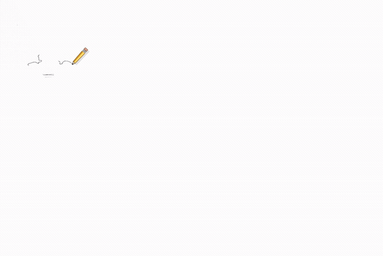

# Retrace

Retrace turns a PNG or JPG drawing into a natural-looking speed-drawing video.

## What does “raster” mean?

A raster image is a normal pixel-based image, such as a PNG or JPG. Retrace reads those pixels directly, so you do not have to manually convert the artwork into SVG paths first.

## Why Retrace is different

Most simple draw-on tools expect a small number of clean vector paths. Retrace starts with the finished raster image and reconstructs a drawing process from it. That means it can work with highly detailed illustrations containing thousands of small marks, preserve the original grayscale appearance, and show the pencil moving through the artwork.

The result is not just an image sliding onto the screen—it is a generated sequence of individual drawing paths that rebuilds the PNG.

## Use case

Retrace is useful for portfolio demos, art-process videos, visual explanations, and experiments with computer vision and human-like motion.

## City demo — 25 seconds



The preview plays directly in the README. The full-resolution H.264 version is [`output/city.mp4`](output/city.mp4).

Input: [`city.png`](city.png)

## Documentation at a glance

| Part | What it does | Main file |
| --- | --- | --- |
| Input | Reads the PNG and extracts dark ink | `drawing/preprocess.py` |
| Skeleton | Finds drawable centerlines in the ink | `drawing/preprocess.py` |
| Tracing | Turns the centerlines into individual paths | `drawing/trace.py` |
| Ordering | Chooses what gets drawn first, next, and last | `drawing/order.py` |
| Rendering | Reveals the original pixels as the pencil moves | `drawing/render.py` |
| CLI | Runs the complete pipeline and writes the MP4 | `draw.py` |

## Installation and running

Retrace is currently a source-based Python project rather than a published pip package. Install it with a virtual environment:

```powershell
git clone https://github.com/YarnGrowler/Retrace.git
cd Retrace
python -m venv .venv
.\.venv\Scripts\Activate.ps1
pip install -r requirements.txt
python draw.py city.png --duration 25 --fps 30 --no-preview
```

The output is written to `output/city.mp4`. Use `--duration auto` when every small stroke needs visible time under the pencil, and `--debug` to write the intermediate images.

## In one sentence

**Give Retrace a finished PNG; it reconstructs a detailed, pencil-led drawing video from the pixels.**
